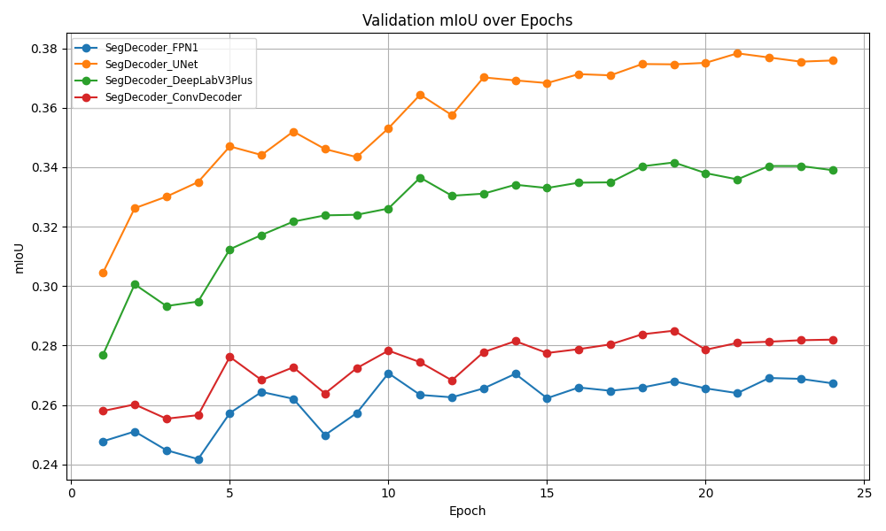

## Disclaimer: 
This is a repo to compare various semantic decoders for academic purpose. All the work is based on the open source information. 


# Evaluating Semantic Decoders for BEV Transformer-based Perception

> A practical investigation into which decoder architecture best transforms expressive BEV features into accurate semantic segmentation maps for autonomous driving.

---

## Project Goal

To **evaluate and benchmark various semantic decoder architectures** (segmentation heads) for **transformer-based BEV perception systems**, particularly those using BEVFormer-style encoders. The aim is to understand which decoder designs offer the best trade-off between **accuracy**, **latency**, and **memory consumption** for real-world autonomous driving (AD) applications.

---

## Motivation

In modern autonomous driving stacks:

- The **decoder architecture** plays a **critical role** in downstream performance.
- It directly affects:
  - **Latency**
  - **Memory footprint**
  - **Semantic granularity**
  - **Accuracy of small static objects**
- This is especially crucial for **dense BEV outputs** and **edge deployment**, where every millisecond and megabyte counts.

While transformer-based encoders like **BEVFormer**, **PETR**, or **BEVSegFormer** have received substantial attention, decoder design is still **underexplored** in both research and industry. This project challenges the assumption that "any decoder will do" and frames decoder design as a potential **last-mile bottleneck** in real-time, resource-constrained environments.

> Can smart decoder design unlock meaningful improvements in edge-ready semantic perception?

---

## Key Research Questions

| Question                                                                 | ✅ Finding |
|--------------------------------------------------------------------------|------------|
| Does a simple MLP suffice as a BEV decoder?                              | No. Performance plateaus at ~27% mIoU. |
| How much do skip connections / multi-scale designs help?                 | Under exploration |
| Are convolutional decoders like U-Net still the best choice?             | TBD — testing alternatives. |
| Can attention-based decoders outperform U-Net in this setting?           | Under exploration (e.g., SegFormer-style decoders). |

---

## Key Metrics

| Metric                  | Description                                          |
|-------------------------|------------------------------------------------------|
| **mIoU**                | Mean Intersection over Union (semantic accuracy).    |
| **Inference Speed**     | Frames per second (fps) on edge device.              |
| **Memory Consumption**  | GPU memory usage during inference.                   |
| **(Optional) Range**    | Effective semantic range of detection.               |
| **(Optional) Detail**   | Performance on small static objects.                 |

---

## Evaluation Setup

- **Backbone**: ResNet-based CNN
- **Neck**: Feature Pyramid Network (FPN)
- **Encoder**: Transformer-based BEVFormer
- All **upstream modules are frozen** to isolate decoder effects.
- **Decoder is the interchangeable module** under evaluation.

---

## Limitations & Caveats

### 1. Diminishing Returns
- Decoder changes may only yield **<1–2% mIoU improvement**.
- Poor-quality BEV features can't be saved by any decoder.

### 2. Context Matters
- The decoder only shines when **framed around constraints**:
  - Edge performance
  - Sparse sensor setups
  - Real-time streaming or robustness

> This project frames decoder design as a **performance bottleneck** in edge-oriented AD systems.

---

## Candidate Decoders

- **Baseline**: MLP (2-layer head)
- **UNet-style** convolutional decoder
- **Multi-scale + skip connection** decoders
- **Attention-based** SegFormer-inspired head
- Other lightweight or hybrid designs

---

## Decoder Performance Overview

The chart below summarizes the **mean IoU (mIoU)** achieved by different decoder architectures evaluated in this project:



---

## Project Structure (Tentative)

```text
bev_decoder_eval/
├── configs/           # MMDetection & BEVFormer config variants
├── models/            # Custom decoder modules (U-Net, MLP, attention, etc.)
├── experiments/       # Logs, checkpoints, evaluation results
├── scripts/           # Training, inference, evaluation utilities
├── assets/            # Visualizations (e.g., all_decoders_miou.png)
└── README.md          # Project description and documentation
```
---

## Future Directions

- Test on **sparser sensor configurations** (e.g. fewer cameras).
- Study **online or adaptive decoding** strategies.
- Profile decoders under **varying resolution constraints**.


---

## Acknowledgement
This project references code libraries such as BEVerse, OpenMMLab, BEVFormer_segmentation_detection, BEVDet, HDMapNet, etc. 
