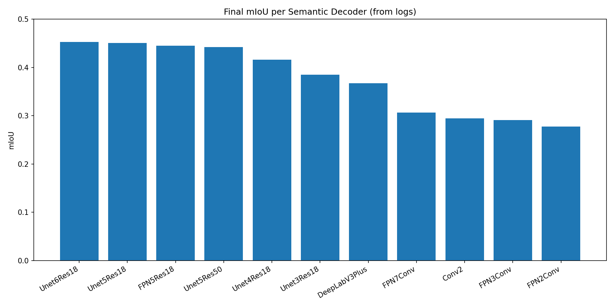
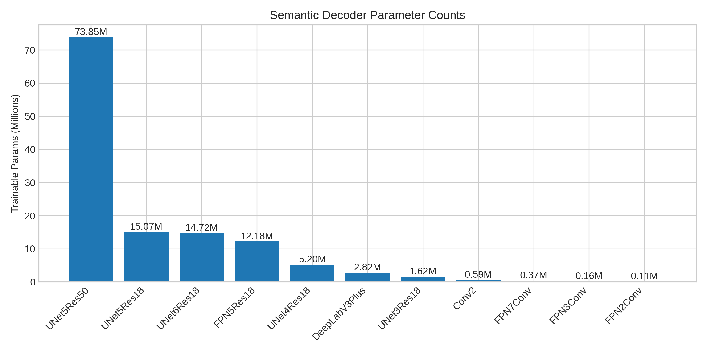
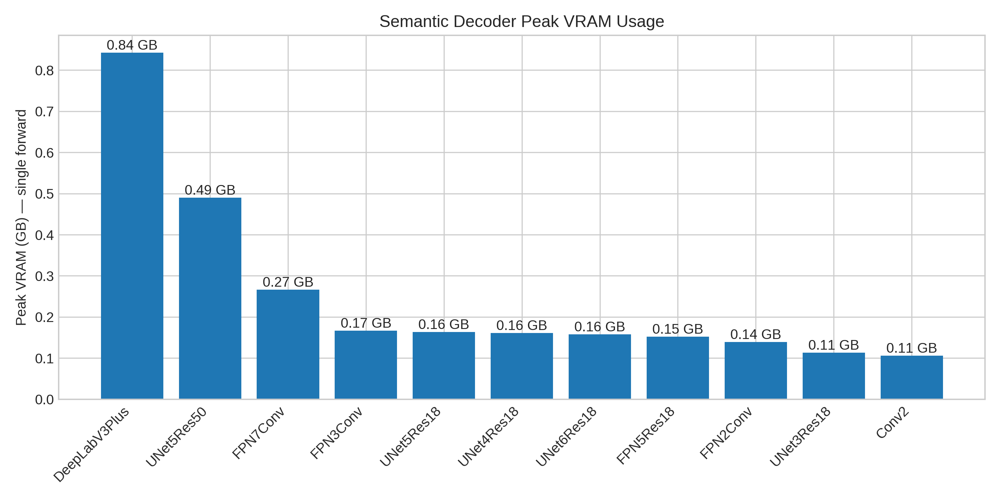
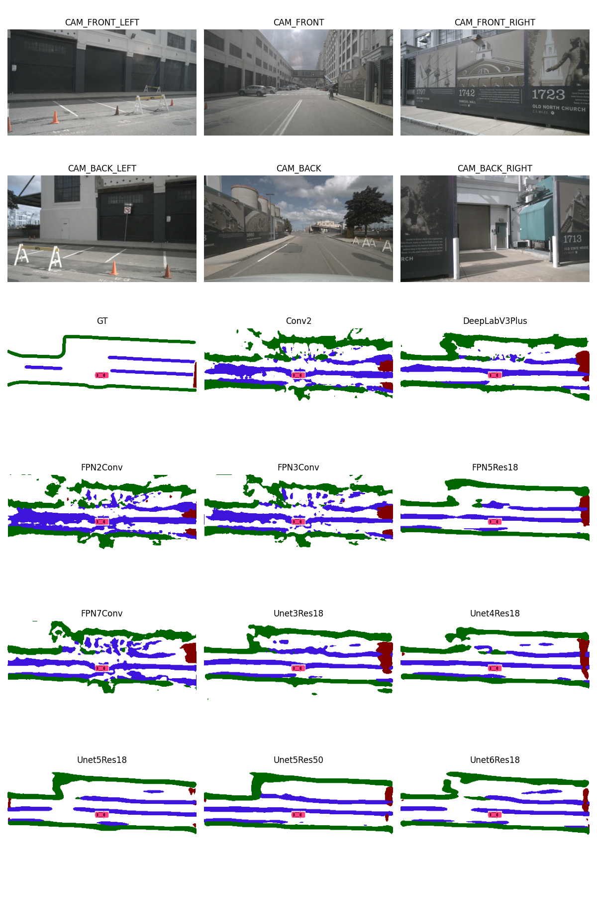

## Disclaimer: 
This is a repo to compare various semantic decoders for BEVFormer.All the work is based on the open source information and is exclusively for academic purpose. 


# Evaluating Semantic Decoders for BEV Transformer-based Perception

> A practical investigation into which decoder architecture best transforms expressive BEV features into accurate semantic segmentation maps for autonomous driving.

---

## Project Goal

To **evaluate and benchmark various semantic decoder architectures** (segmentation heads) for **transformer-based BEV perception systems**, particularly those using BEVFormer-style encoders. The aim is to understand which decoder designs offer the best trade-off between **accuracy**, **latency**, and **memory consumption** for real-world autonomous driving (AD) applications.

---

## Motivation

In modern autonomous driving stacks:

- The **decoder architecture** plays a **critical role** in downstream performance.
- It directly affects:
  - **Latency**
  - **Memory footprint**
  - **Semantic granularity**
  - **Accuracy of small static objects**
- This is especially crucial for **dense BEV outputs** and **edge deployment**, where every millisecond and megabyte counts.

While transformer-based encoders like **BEVFormer**, **PETR**, or **BEVSegFormer** have received substantial attention, decoder design is still **underexplored** in both research and industry. This project frames decoder design as a potential improvmement in real-time, resource-constrained environments.

> Can smart decoder design unlock meaningful improvements in edge-ready semantic perception?


---

## Candidate Decoders

- **Baseline**: convolutional decoder
- **FPN**
- **DeepLab**
- **UNet** 


To better understand their architectural differences, strengths, and trade-offs, the following table compares the core semantic decoders explored in this project:

### Semantic Decoder Comparison

| Feature                         | **U-Net**                          | **FPN**                              | **DeepLabV3+**                          | **ConvDecoder**                     |
|----------------------------------|-------------------------------------|----------------------------------------|------------------------------------------|--------------------------------------|
| **Decoder Depth**               | Deep (symmetrical to encoder)       | Shallow                                | Shallow                                  | Shallow                              |
| **Fusion Strategy**             | Skip-connections + concatenation    | Top-down + lateral + summation         | Concatenation (dilated + global pooling) | None — single-path conv stack       |
| **Multi-scale Input**           | Encoder features at all depths      | Multi-resolution encoder outputs       | Multi-scale dilated convs from one map   | Single-resolution encoder output     |
| **Global Context**              |  No                                |  No                                   |  Yes (via image-level pooling)          |  No                                 |
| **Upsampling Method**           | Transposed conv or bilinear         | Bilinear                               | Bilinear                                 | Bilinear                             |
| **Spatial Detail Recovery**     |  High (dense skip paths)           | Moderate (single-skip at each level)   | Low to Moderate (1 skip optional)        |  Poor (no skip or context)         |
| **Output Resolution**           | Full (H × W)                        | Full (H × W)                            | Full (H × W) via final upsample          | Full (H × W)                         |
| **Computation**                 | High                                | Low                                     | Medium–High                              | Very Low                             |
| **Strengths**                   | Fine detail, smooth edges           | Efficient multi-scale fusion           | Strong semantic context                  | Fast, minimal memory                 |
| **Weaknesses**                  | Heavy decoder, no global context    | No global awareness                    | Weaker on fine edges                     | No scale or context awareness       |
| **Best Use Cases**              | Lanes, curbs, thin shapes           | Road layout, mid-scale structures      | Drivable area, segmentation with context | Simple masks, fast inference        |

> This comparison highlights that while **U-Net** excels at preserving fine details, **DeepLabV3+** offers superior global context, **FPN** balances multi-scale fusion and efficiency, and **ConvDecoder** serves as a minimal, fast baseline.

---

In order to evaluate which semantic decoders are the best, we need some KPI to evaluate the model performance.

## Key Metrics

| Metric                  | Description                                          |
|-------------------------|------------------------------------------------------|
| **mIoU**                | Mean Intersection over Union (semantic accuracy).    |
| **Inference Speed**     | Frames per second (fps) on edge device.              |
| **Memory Consumption**  | GPU memory usage during inference.                   |
| **(Optional) Range**    | Effective semantic range of detection.               |
| **(Optional) Detail**   | Performance on small static objects.                 |

---


In order to optimize the semantic decoder desgin, we will address the following questions:

## Research Questions

| Question                                                                 | ✅ Finding |
|--------------------------------------------------------------------------|------------|
| Does a simple MLP suffice as a BEV decoder?                              | No. mIoU varies between a simple MLP at 22% and a deep Unet at 40% |
| How much do skip connections / multi-scale designs help?                 | Deeper skip connections / multi-scale desgin improve the performance |
| Are convolutional decoders like U-Net still the best choice?             | Yes, so far Unet is the best netwok in the CNN architecture. |
| Can attention-based decoders outperform U-Net in this setting?           | Under exploration (e.g., SegFormer-style decoders). |

---


## Evaluation Setup

- **Backbone**: ResNet-based CNN
- **Neck**: Feature Pyramid Network (FPN)
- **Encoder**: Transformer-based BEVFormer
- All **upstream modules are frozen** to isolate decoder effects.
- **Decoder is the interchangeable module** under evaluation.

---


## Semantic Decoder Evaluation

We evaluated a range of semantic decoder architectures on three dimensions:

1. **Segmentation quality** (mIoU over epochs)  
2. **Model size** (trainable parameter count)  
3. **Inference speed** (FPS, ms)

---

### 1. mIoU Evaluation

Each decoder was trained under the same BEVFormer-based pipeline using identical BEV feature maps. The plot below shows validation **mIoU over training epochs**, sorted by peak mIoU.

| Decoder Architecture     | mIoU |
|--------------------------|------|
| Unet6Res18               | 0.4524 |
| Unet5Res18               | 0.4505 |
| FPN5Res18                | 0.4447 |
| Unet5Res50               | 0.4421 |
| Unet4Res18               | 0.4159 |
| Unet3Res18               | 0.385 |
| DeepLabV3Plus            | 0.3674 |
| FPN7Conv                 | 0.3063 |
| Conv2                    | 0.2944 |
| FPN3Conv                 | 0.2911 |
| FPN2Conv                 | 0.2771 |

<div align="center">
  
</div>

This helps identify which architectures converge faster and reach higher segmentation accuracy.

---

### 2. Model Size Evaluation

We benchmarked the **number of trainable parameters** and the **peak VRAM usage (single forward)** for each decoder.

| Decoder Architecture     | Trainable (M) | Total (M) | Peak VRAM (GB) |
|--------------------------|---------------|-----------|----------------|
| UNet5Res50               |       73.85 |    146.91 |          0.490 |
| UNet5Res18               |       15.07 |     29.33 |          0.163 |
| UNet6Res18               |       14.72 |     29.10 |          0.157 |
| FPN5Res18                |       12.18 |     23.35 |          0.152 |
| UNet4Res18               |        5.20 |      9.30 |          0.161 |
| DeepLabV3Plus            |        2.82 |      5.05 |          0.843 |
| UNet3Res18               |        1.62 |      2.45 |          0.113 |
| Conv2                    |        0.59 |      0.59 |          0.106 |
| FPN7Conv                 |        0.37 |      0.37 |          0.266 |
| FPN3Conv                 |        0.16 |      0.16 |          0.167 |
| FPN2Conv                 |        0.11 |      0.11 |          0.139 |

<div align="center">
  
</div>

<div align="center">
  
</div>

---
### 3. Inference Speed Evaluation

We measured average inference latency (batch size = 1, input: 256×128×128) on a single GPU.

| Decoder                 | Full Time (ms) | FPS Full | Decoder-Only (ms) | FPS Dec |
|-------------------------|----------------|----------|-------------------|---------|
| Conv2                   | 517.20         | 1.93     | 3.60              | 277.78  |
| DeepLabV3Plus           | 576.40         | 1.73     | 33.40             | 29.94   |
| FPN2Conv                | 433.00         | 2.31     | 1.30              | 769.23  |
| FPN3Conv                | 589.00         | 1.70     | 1.60              | 625.00  |
| FPN5Res18               | 376.00         | 2.66     | 3.40              | 294.12  |
| FPN7Conv                | 602.10         | 1.66     | 2.70              | 370.37  |
| UNet3Res18              | 494.30         | 2.02     | 2.50              | 400.00  |
| UNet4Res18              | 586.40         | 1.71     | 6.30              | 158.73  |
| UNet5Res18              | 584.80         | 1.71     | 4.10              | 243.90  |
| UNet5Res50              | 353.50         | 2.83     | 18.50             | 54.05   |
| UNet6Res18              | 341.20         | 2.93     | 3.30              | 303.03  |


### 4. Result Visualization



## Project Structure (Tentative)

```text
bev_decoder_eval/
├── configs/           # MMDetection & BEVFormer config variants
├── models/            # Custom decoder modules (U-Net, MLP, attention, etc.)
├── experiments/       # Logs, checkpoints, evaluation results
├── scripts/           # Training, inference, evaluation utilities
├── assets/            # Visualizations (e.g., all_decoders_miou.png)
└── README.md          # Project description and documentation
```
---

## Acknowledgement
This project references code libraries such as BEVerse, OpenMMLab, BEVFormer_segmentation_detection, BEVDet, HDMapNet, etc. 
